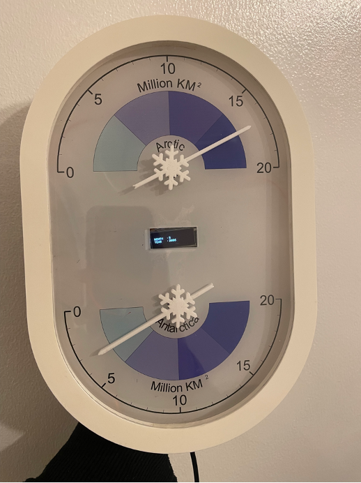
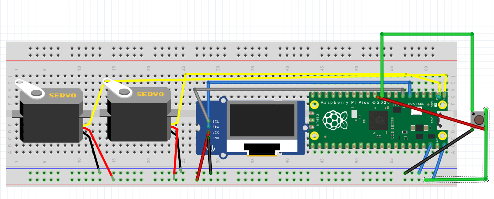
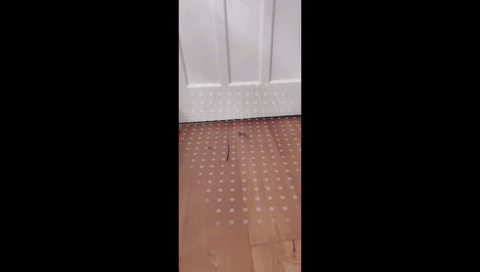

# Sea Ice Extent Gauge #
> CASA0019: Sensor Data Visualisation.

> Group 6 - Ice Ice Baby (Mark Foster, Satria Mitra Utama, Qingyao Tang).

<p align="center" width="100%">
     
</p>


## Overview
This guide provides step-by-step instructions for building the Sea Ice Extent Gauge, a device designed to visualize changes in polar sea ice. This project, part of the CASA0019 course at University College London, aims to raise awareness about sea ice's importance and the impact of climate change.

## Table of Content
<details>
<summary>(click to expand)</summary>

1. Introduction
2. Components Required
3. Assembly Instructions
4. Software Setup
5. Using the Device
6. Additional Resources
7. References
8. Contributors

</details>

## 1. Introduction
The Sea Ice Extent Gauge visualizes real-time changes in Arctic and Antarctic sea ice coverage. It combines a physical device with an interactive digital twin, highlighting the urgency of environmental protection.

## 2. Components Required
- Raspberry Pico W microcontroller
- MG90S servos (2)
- 0.91-inch OLED display
- Metal Push Button LED
- Various electronic components (resistors, wires, etc.)

## 3. Assembly Instructions
### 3.1 Building the Hardware


Assemble the physical gauge using the Raspberry Pico W as the control center, connect the servos, OLED display, and LED push button according to the pin configuration provided.

|No|Components	    |Pin	|Raspberry Pico Pin|
---|----------------|:-----:|:----------------:|
|1 |Servo MG90S (1)	|VCC	|VBUS  | 
|  |	            |GND	|GND   |
|  |	            |Data	|GP0   |
|2 |Servo MG90S (2)	|VCC	|VBUS  |
|  |		        |GND	|GND   |
|  |	            |Data	|GP1   |
|3 |Oled Display 0.91 Inch|	VCC|	VBUS|
|	|	|GND|	GND|
|	|	|SDA	|GP4|
|	|	|SCL	|GP5|
|4|	LED Push Button|	VCC (+)	|GP8
|	|	|GND (-)	|GND
|	|	|SW0	|VBUS|
|	|	|SW1	|GP7|


### 3.2 Crafting the Physical Display
Create two semicircular charts to represent sea ice cover in the Arctic and Antarctic. Use shades of blue to indicate changes in ice coverage.

## 4. Software Setup
### 4.1 Programming the Raspberry Pico
#### 4.1.1 Install libraries
Set up the Raspberry Pico using Arduino IDE and run script `dial_gauge.ino`that collects data from MQTT Broker. 
Install necessary libraries like :
- [ESP8266 wifi](https://github.com/esp8266/Arduino/tree/master/libraries/ESP8266WiFi)
- [Pubsub client](https://www.arduino.cc/reference/en/libraries/pubsubclient/)
- [Adafruit Oled SSD1306](https://www.arduino.cc/reference/en/libraries/adafruit-ssd1306/)
- [Adafruit GFX Library](https://www.arduino.cc/reference/en/libraries/adafruit-gfx-library/)

#### 4.1.2 Config mqtt brokers & wifi
Create file named `arduino_secrets.h` within the same folder of the scripts and add your mqtt broker details 
```
//MQTT Broker & password
const char* mqttuser = "<username>";
const char* mqttpass = "<password>";
const char* mqtt_server = "<host>";
```
Don't forget to chane your wifi credentials on the scripts
```
const char* ssid = "<wifi>";
const char* password = "<password>";
```

### 4.2 Unity Augmented Reality Integration
Develop an AR version using Unity to mimic the physical device. Include additional functionalities like displaying videos and extra data on sea ice changes.

Scan this qrcode to install the AR application for Android


## 5. Using the Device
### 5.1 Interacting with the Gauge
The device uses servos to indicate sea ice extent and an OLED display to show dates. Press the LED button to toggle between historical and current data.

### 5.2 Exploring the Digital Twin
Use the Unity AR interface to access more detailed information and visualizations about sea ice changes.




## 6. Additional Resources
- [GitHub Repository](https://github.com/mfoster0/DataVis-GrpProj)
- Assembly diagrams and schematics

## 7. Contributors
- Mark Foster
- Satria Mitra Utama
- Qingyao Tang

---

*This README was created for the Sea Ice Extent Gauge project, part of the CASA0019 course at University College London by Group 6, Ice Ice Baby.*


